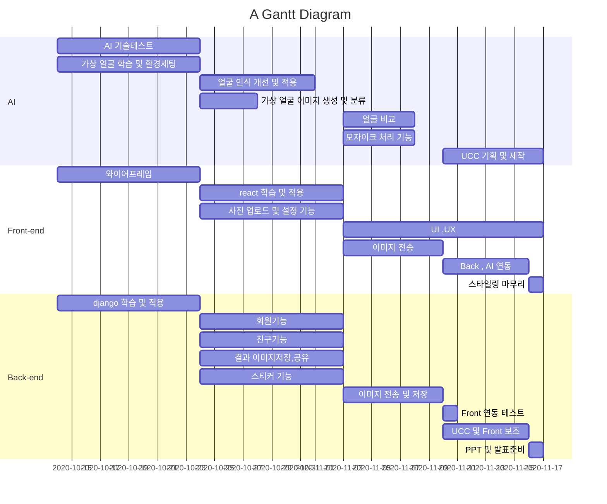


## 📖 프로젝트 소개

`FACE OFF`는 손쉬운 사진 모자이크 웹 어플리케이션입니다.

:house: http://k3a207.p.ssafy.io/


## :fire: Gantt 




### 기획 배경 및 의도

- 블로그, 인스타그램 등 이미지 중심 SNS는 일상의 일부로 자리잡았고, 때와 장소를 가리지 않은 사진들이 SNS에 공유되고 있습니다. 이런 사회적 변화와 함께 초상권 침해 피해도 증가하고 있습니다. 방송통신심의위원회의 발표에 따르면 초상권 침해 피해 신고사례는
  2014년 5,017건에서 2018년 1만 건 이상으로 크게 증가하였습니다. 

- 사진 수정 어플리케이션 등을 통해 모자이크 처리를 할 수 있지만, 직접 영역을 선택해야하고 모자이크를 하면 사진이 부자연스러워지는 문제가 있었습니다. 또한 앱스토어에서 어플리케이션을 다운로드 받아야하는 불편이 존재했습니다.

- 이에 우리 팀은 보다 손쉽게 사진에 모자이크를 적용할 수 있는 웹 어플리케이션을 개발하여 이러한 불편을 해소하고자 하였습니다.


### 핵심 기능

- **자동 얼굴인식**

  - AI 기반 자동 얼굴인식 기술을 이용하여 빠르게 수정하지 않을 인물을 선택할 수 있습니다.

  

- **다양한 모자이크 옵션**

  - 픽셀, 흐리게, 가상얼굴, 스티커 등 다양한 모자이크 옵션을 제공합니다.

  - 가상얼굴 옵션은 대상의 얼굴을 가리는 대신, AI가 생성한 가상얼굴로 대체함으로써 보다 자연스러운 결과물을 얻을 수 있습니다.

    

- **소셜 로그인 및 친구 얼굴 등록**

  - 카카오, 구글 아이디 등을 통해 손쉽게 회원가입하고 로그인할 수 있습니다.
  - 자동 얼굴인식 단계에서 등록된 친구 얼굴을 찾아 이름을 표시해주고, 모자이크 대상에서 자동으로 제외합니다.


- **다운로드 및 공유**
  - 손쉽게 사진을 다운로드하고, 친구들에게 공유할 수 있습니다.


## 드래곤볼 팀 소개

- `드래곤볼` 이란 7개의 구슬을 모아 소원을 이루어주는 아이템입니다.

   `드래곤볼`이라는 팀 이름은, 드래곤볼처럼 모여서 사람들의 불편을 해결해 줄 수 있는 서비스를 개발하겠다는 의지를 담고 있습니다.


### 팀원 구성

	👦 문명기 : 팀장 / Backend 
	
	🧑 정세린 : Backend Tech Leader
	
	🧔 이원준 : Frontend Tech Leader
	
	🧑 박태웅 : Frontend
	
	🧒 오정엽 : AI Tech Leader
	
	🧒 양지용 : AI


## 💻 기술 스택

### Frontend

- React.js 
  - 네이티브 앱과 같이 뛰어난 사용성을 제공하는 SPA를 구현하고자 React.js를 채택하였습니다.
- TypeScript
  - 개발의 생산성과 유지보수의 용이성을 위해 타입스크립트를 도입하고자 하였습니다.
- Sass (Scss)
  - 스타일링 측면에서의 개발 생산성을 높이기 위해 Sass를 채택하였습니다.


### Backend

- Django
  - TensorFlow와의 결합을 용이하게 하기 위하여 프레임워크로 Django를 채택하였습니다.
- TensorFlow
- MariaDB


### Dev-Ops

- AWS EC2
- Jenkins
  - CI/CD 자동화를 통해 개발 생산성을 높이기 위하여 Jenkins를 도입하였습니다.
- Docker
  - 배포에서의 용이성을 위하여 Docker를 도입하였습니다.


## :hammer: git branch 정책 
 master -> develop -> feat/기능이름

- master : 제품으로 출시하는 branch
- develop : 다음 출시버전을 개발하는 branch
- feat/ : 기능을 개발하는 branch 


## :page_facing_up: Coding Convention

### Back-end 

#### Base

- 4 space(1 tab) 들여쓰기를 사용한다.
- 함수명 위에 한줄 주석으로 기능을 정의한다.
- swagger 를 이용해 parameter 및 return 값을 명시한다. 

#### Naming Conventions

- 클래스 명은 카멜케이스(CamelCase)로 작성한다.
- 함수명은 소문자로 구성하되 필요하면 밑줄(find_user)로 나눈다.
- DB의 테이블, 컬럼명은 대문자로 정의한다. 

### Front-end 

#### Base

- 세미콜론을 사용한다.
- 2 space 들여쓰기를 사용한다.

#### React

- 기본적으로 Airbnb React Style Guide를 준수한다.

- 컴포넌트 이름은 PascalCase로 작성한다.

- 컴포넌트 이름은 큰 범주로부터 세부 기능의 순서로 한다.

  - HomeButtonLogin.tsx
  - page / type / function

#### TypeScript

- class는 PascalCase로 작성한다.

- interface 이름은 PascalCase로 작성한다. interface임을 나타내기 위해 I를 이지 않는다.

  - TypeScript 소스코드에서 중요 interface를 네이밍할 때 I 를 붙이지 않음

  ``` typescript
  // bad
  interface IFoo {
      name: string
  };
  
  // good
  interface Foo {
      name: String
  };

  ```


📷 프로젝트 영상 : https://youtu.be/Ki_Ag9Z8JYc


:memo: Jenkins : http://k3a207.p.ssafy.io:8181/

