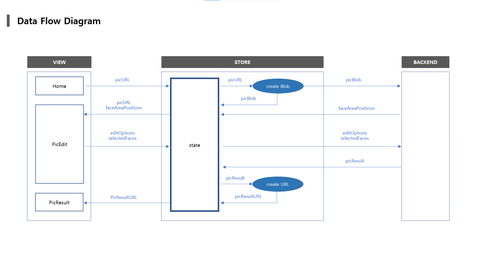
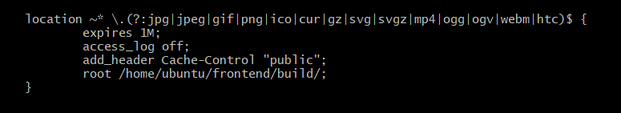

# Frontend

## 시작하기

``` bash
// s03p31a207/frontend 디렉토리
npm install
npm start
```


## 개발 가이드

- 협업을 위해 공유가 필요한 주요 내용들입니다.


### 1. 스타일 가이드

##### 1) Base

- 세미콜론을 사용합니다.
- 2 space 들여쓰기를 사용합니다.


##### 2) React

- 기본적으로 [Airbnb React Style Guide]((https://github.com/airbnb/javascript/tree/master/react#basic-rules))를 최대한 준수합니다.

- 컴포넌트
  - 컴포넌트 이름은 PascalCase로 작성합니다.

  - 컴포넌트는 가능한 함수형으로 작성합니다.

  - 컴포넌트 이름은 큰 범주로부터 세부 기능의 순서로 작성합니다.

    - ex) HomeButtonLogin.tsx (page / type / function)

      


##### 3) TypeScript

- interface 이름은 PascalCase로 작성합니다.

  

##### 4) Redux

- Store 구현 설명과 예시는 frontend/README.md의 `2. Redux` 를 참고합니다.

- `Container + Presenter` 패턴을 사용합니다.

  - 로직만 처리하는 Container와 화면을 구현하는 Presenter를 구분하여 사용하는 패턴입니다.
  - Container는 Presenter를 하위 컴포넌트로 갖고, 구현한 로직을 전

- Container
  - Container에서 Presenter에 `state`와 `action`을 전달할 때, 각각 `state`, `methods` 객체 안에 저장하여 전달합니다.
  - 하위 컴포넌트는 해체할당을 이용해 `state`와 `methods`에서 필요한 값과 함수를 변수에 할당하여 사용할 수 있습니다.
  - 전달할 `state`, `methods` 가 2개 이하일 경우 각각의 이름을 사용하여 prop으로 전달할 수 있습니다.
  - 컨테이너의 기본 구성은 다음 예시와 같습니다.
    - `import` 는 맨 위에서 수행합니다.
    - `React`  / 하위 컴포넌트 = presenter / 기타 모듈 / `redux`관련 모듈을 순서대로 `import` 합니다.
    - 컴포넌트 내부에는 라이브러리 관련 변수 / `state` / `methods` 를 순서대로 선언합니다.

  ``` tsx
  import React from 'react';
  
  // components
  import Message from './Message';
  
  // modules
  import { useHistory } from 'react-router-dom';
  
  // redux
  import { useDispatch, useSelector } from 'react-redux';
  import { hideMessage } from '../../redux/modules/message';
  import { RootState } from '../../index';
  
  
  function MessageContainer() {
    const dispatch = useDispatch()
    const history = useHistory()
  
    // state
    const state = useSelector((state: RootState) => state.message);
  
    // methods
    const methods = {
      close() {
        dispatch(hideMessage());
        history.push(state.redirectTo);
      }
    }
  
    return <Message state={state} methods={methods} />
  }
  
  export default MessageContainer;
  ```

- Presenter

  - Presenter는 Container로부터 받은 `state`와 `methods`를 이용하여 화면을 구성하는 컴포넌트입니다.
  - Presenter의 예시는 다음과 같습니다.
  - 전달인자 `props`에서 해체할당으로 `state`, `methods`를 매개변수로 받습니다.
    - 해체할당으로 사용할 변수를 선언합니다.
  
  ``` tsx
  import React from 'react';
  import './Message.scss';
  
  function Message({ state, methods }) {
    const { msgShow, msgType, msgText } = state;
    const { close } = methods;
  
    return (
      <>
        { msgShow &&
        <div className="overlay">
          <div className="msg-card">
            <div className="msg-card-title">{ msgType }</div>
            <div className="msg-card-text">{ msgText }</div>
            <div className="msg-card-footer">
              <div onClick={close} className="msg-card-button">확인</div>
            </div>
          </div>
        </div>
        }
      </>
    );
  }
  
  export default Message;
  ```


### 2. Redux

##### 1) 사용 라이브러리

- `redux`공식문서의 권고에 따라 `@reduxjs/toolkit`라이브러리를 사용합니다.
- `react`프로젝트와의 통합을 위해 `react-redux`라이브러리를 사용합니다.


##### 2) 폴더구조 및 설명

```
📦src
 ┣ 📂pages
 ┃ ┣ 📂PicEdit
 ┃ ┃ ┗ 📜PicEdit.tsx
 ┃ ┃ ┗ 📜PicEditContainer.tsx
 ┃ ┗ ...
 ┣ 📂redux
 ┃ ┣ 📂modules
 ┃ ┃ ┣ 📜auth.ts
 ┃ ┃ ┗ 📜editOptions.ts
 ┃ ┗ 📜index.ts
 ┣ 📜index.tsx
 ┣ ...

```

  - 모든 `redux` 로직 구현은 `src/redux` 폴더에서 수행합니다.
  - `redux` 로직 구현은 `redux toolkit`을 통해 수행합니다.
  - 한 가지 기능에 관련된 `action`, `reducer`를 하나의 모듈 내에서 구현하는 `Ducks Pattern`을 사용합니다.
    각 모듈은 하나의 `reducer`를 `export`합니다.
  - 각 모듈들은 `redux/index.ts` 파일에서 `combineReducers`를 통해 하나의 `rootReducer`로 통합됩니다.
  - `rootReducer`는  `src/index.tsx` 파일에서 `configureStore`를 통해 스토어로 구현되고,
    구현된 스토어는 `react-redux`의 `Provider`를 통해 루트 컴포넌트에 주입됩니다.
  - 스토어가 주입되고 나면, 하위 컴포넌트는 `react-redux`의 `connect()` 함수를 통해 스토어에 접근하거나
    `useSelector`, `useDispatch`를 통해 각각 `state`, `action`에 접근할 수 있습니다.
    우리 프로젝트에서는 `useSelector`와 `useDispatch`를 사용합니다.
  - 스토어에 접근하는 컴포넌트는 가능한 `container`로 한정하고, 하위 컴포넌트에 `props`로 전달하여 사용합니다.


##### 3) 코드 샘플 및 설명

- module/editOption.ts

``` typescript
import { createAction, createReducer } from '@reduxjs/toolkit';

/*
[Action Types]
- actionType을 정의합니다.
- 액션타입은 일반적인 컨벤션에 따라 UPPER_SNAKE_CASE로 작성합니다.
- 다른 모듈과의 네임스페이스 충돌을 피하기 위해 앞에 모듈 이름을 추가합니다.
*/
const SET_OPTION_TYPE: string = 'editOptions/SET_OPTION_TYPE';

/* 
[Actions]
- 정의된 actionType에 해당하는 action에서 반환하는 값을 정의합니다.
- 반환된 값은 reducer로 전달되어 store의 state를 변경합니다.
- createAction의 첫번째 인자로는 actionType을,
  두번째 인자로는 콜백함수 prepare를 전달합니다.
- prepare함수는 action에 인자를 전달했을 때,
  그 인자를 action의 반환값에 payload로 추가해주는 역할을 수행합니다.
- prepare함수에는 화살표함수를 사용할 수 없습니다.

*/
export const setOptionType = createAction(
    SET_OPTION_TYPE,
    function prepare(optionType: number) {
        return { payload: { optionType } };
	}
);

/*
[Initial State]
- 해당 store의 최초 state를 정의합니다.
*/
const initialState = {
  optionType: 0,
  optionLevel: 3
}

/*
[Reducer]
- store의 state를 변경하는 역할을 수행합니다.
- builder를 통해 선언형으로 state의 값을 변경할 수 있습니다.
*/
const editOptions = createReducer(
    initialState,
    (builder) => {
      builder
      .addCase(setOptionType, (state, action) => {
        state.optionType = action.payload.optionType
      })
      .addCase(setOptionLevel, (state, action) => {
        state.optionLevel = action.payload.optionLevel
      })
	}
)

// reducer를 반환하고, 반환된 reducer는 redux/index.ts 파일에서 combine됩니다.
export default editOptions 
```


### 3. API

- 백엔드 API에 요청을 보내고 받는 로직은 모두 `src/api/index.ts` 에서 작성되고 관리됩니다. 

- 다른 컴포넌트에서는 이 api 모듈을 호출하여 `API.signup(data)` 와 같은 형식으로 사용할 수 있습니다.

  

### 4. 빌드 및 배포

- AWS 서버에 접속

  ``` bash
  ssh -i K3A207T.pem ubuntu@k3a207.p.ssafy.io
  ```
```

- apt 업데이트 / 업그레이드

  ``` bash
  sudo apt update
  sudo apt upgrade
```

- nodejs, npm설치

  - -y --yes --assume-yes : 프롬프트의 interactive 질문들을 모두 yes로 처리

  ``` bash
  sudo apt-get install -y nodejs
  sudo apt-get install npm
  ```

- 빌드

  - /home/ubuntu/frontend/build 폴더 생성

  ``` bash
  cd /home/ubuntu/frontend
  sudo npm run build
  ```

- nginx 설치

  ``` bash
  sudo apt-get isntall nginx
  ```

- UFW(Uncomplicated Firewall; 방화벽)에서 Nginx의 80 포트 열기

  - https 적용시 'Nginx HTTPS' 추가 허용

  ``` bash
  ufw app list
  sudo ufw allow 'Nginx HTTP'
  ```

- 설정 파일 수정

  - vi 에디터로 파일을 연 뒤 `a`를 눌러 수정 모드 전환, 수정 후 `esc` -> `:wq` 입력하여 저장 및 종료 (write + quit)

  ``` bash
  sudo vi /etc/nginx/sites-available/default
  
  root /home/ubuntu/frontend/build #dist 폴더 연결
  	location/ {
  		try_files $uri $uri/ /index.html #서버 요청 시 실행 파일 index.html로 변경	
  	}
  ```

- Nginx 재시작

  ``` bash
  sudo service nginx restart
  ```

  

### 5. 자료흐름도




## Dependencies & Settings

### Project Dependencies

- CRA with TypeScript

  ``` bash
  npx create-react-app frontend --template typescript
  ```

- @types/react

  ``` bash
  npm install @types/react
  ```

- React-redux

  ```
  npm install react-redux @types/react-redux
  ```

- Redux Toolkit

  ``` bash
  npm install @reduxjs/toolkit
  ```

- SASS

  ``` bash
  npm install node-sass sass-loader @types/node-sass
  ```
  
- React Router DOM

  ``` bash
  npm install react-router-dom
  ```

- React libraries

  - classnames
  - styled Components
  
  ``` bash
  npm install classnames @types/classnames
  npm install styled-components
  ```
- React Social Login

  ``` bash
  npm install react-google-login
  npm install react-kakao-login
  ```


### VS Code

- React Snippets

  extension market에서 `Simple React Snippets` 설치

  
  
- js파일 내부 JSX 자동완성

  VS Code 설정 -> `settings.json` -> 마지막에 하단의 코드 삽입

  ``` json
  {
  	// ...
      "emmet.includeLanguages": {
          "javascript": "javascriptreact"
      }
  }
  ```

- ESLint

  `Extensions`에서 `ESLint` 검색 후 설치


## 외부 참고자료

#### Style Guide

- Airbnb React Style Guide [링크](https://github.com/airbnb/javascript/tree/master/react#basic-rules)
- TypeScript Deep Dive [링크](https://basarat.gitbook.io/typescript/styleguide)
- Redux Style Guide [링크](https://redux.js.org/style-guide/style-guide)


#### React

- React Doc [링크](https://ko.reactjs.org/docs/getting-started.html)
- Create-React-App Doc [링크](https://create-react-app.dev/)


#### Redux

- Redux Doc [링크](https://redux.js.org/introduction/getting-started#create-a-react-redux-app)

- Redux Toolkit Doc [링크](https://redux-toolkit.js.org/introduction/quick-start)

- Codebase Structure [링크](https://www.pluralsight.com/guides/how-to-organize-your-react-+-redux-codebase)

- 휴먼스케이프 기술 블로그 [링크](https://medium.com/humanscape-tech/%EC%8A%AC%EC%8A%AC-hooks%EB%A1%9C-%EC%9D%B4%EC%82%AC-%EA%B0%80%EC%85%94%EC%95%BC%EC%A3%A0-34be22e2962f)

- Mario Fonteles [링크](https://levelup.gitconnected.com/react-functional-components-managing-state-with-redux-and-hooks-a372b1a77514)

- rhostem 블로그 [링크](https://blog.rhostem.com/posts/2020-03-04-redux-toolkits)

  

#### TypeScript

- TypeScript Handbook 한글 문서 [링크](https://typescript-kr.github.io/)
- Heropy Tech : 한 눈에 보는 타입스크립트 [링크](https://heropy.blog/2020/01/27/typescript/)
- Velopert : 리액트 컴포넌트 타입스크립트로 작성하기 [링크](https://velog.io/@velopert/create-typescript-react-component)
- seungha_kim_IT : TypeScript enum을 사용하는 이유 [링크](https://medium.com/@seungha_kim_IT/typescript-enum%EC%9D%84-%EC%82%AC%EC%9A%A9%ED%95%98%EB%8A%94-%EC%9D%B4%EC%9C%A0-3b3ccd8e5552)
- Create React App : Adding TypeScript [링크](https://create-react-app.dev/docs/adding-typescript/)


## Tips & Breakthroughs

#### CSS Module without npm eject

- 스타일시트 파일명을 `.css` / `.scss` 에서 `.module.css` / `.module.scss` 형태로 변경

- `kebab-case` 일 경우 `style["class-name"]` 과 같은 방식으로 호출할 수 있음

  ``` jsx
  import style from './base.module.css'
  
  function App() {
      return (
          <div className="App">
              <div className={ style.box }>box</div>
              <div className={ style["my-box"]}></div>
          </div>
      )
  }
  ```

  

#### TypeScript Error: Could not find a declaration file for module 'foo'

``` 
Could not find a declaration file for module 'react'. 'C:/Users/taew0/Desktop/coding/SSAFY 2/PJT 2-3/temp/s03p31a207/frontend/node_modules/react/index.js' implicitly has an 'any' type.
  If the 'react' package actually exposes this module, consider sending a pull request to amend 'https://github.com/DefinitelyTyped/DefinitelyTyped/tree/master/types/react`  TS7016
```

- type을 명시하지 않았을 때, 암묵적으로 any 타입으로 추론할 수 있도록 해야함
- tsconfig.json 파일에 `"noImplicitAny": false` 추가하여 해결
- ref : [Amandeep Kochhar blog](https://medium.com/@amandeepkochhar/typescript-error-could-not-find-a-declaration-file-for-module-xyz-dfbe6e45c2bd)


#### TypeScript Error:  2569

> formData 관련

``` 
Type 'IterableIterator<[string, FormDataEntryValue]>' is not an array type or a string type. Use compiler option '--downlevelIteration' to allow iterating of iterators.  TS2569
```

- formData의 경우 
  `console.log(formData)` 가 아닌

  ```javascript
  // key,value 모두 확인
  for (let pair of formData.entries()) {
      console.log('key: ',pair[0], 'value: ',pair[1])
  }
  // key 확인
  for (let pair of formData.keys()) {
      console.log('key: ',pair[0], 'value: ',pair[1])
  }
  // value 모두 확인
  for (let pair of formData.values()) {
      console.log('key: ',pair[0], 'value: ',pair[1])
  }
  ```

  의 방식으로 확인해야 함, 이때 TS에서 발생하는 오류

- tsconfig.json 파일에 `downlevelIteration": true` 추가하여 해결

- ref : [stackoverflow](https://stackoverflow.com/questions/49218765/typescript-and-iterator-type-iterableiteratort-is-not-an-array-type)


#### IDE syntax error at `import React from 'react;'`

- @types/react 설치하여 해결합니다.

- 다른 라이브러리에서 유사한 오류가 발생하였을 시, `@types/[library_name]`을 통해 해결할 수 있습니다.

- ref : [stackoverflow](https://stackoverflow.com/questions/41462729/typescript-react-could-not-find-a-declaration-file-for-module-react-material)

  ``` bash
  npm install @types/react
  ```


#### CRA 프로덕션 빌드에서 이미지 파일을 읽어오지 못할 때

- 문제상황
  - 이미지 파일을 컴포넌트에서 `import`하여 사용, 로컬에서 문제없이 동작하였음

  - 빌드 및배포 후 이미지를 찾을 수 없다는 오류 메세지: HTTP 404 Not Found

  - `도메인 + 경로 + 파일명`으로 컴파일 되어있으나, 해당 url로 접근하였을 시 이미지가 표시되지 않음

    

- 해결

  - Webpack 또는 코드의 문제라고 생각하여 `require()` 로 코드 변경을 시도, 실패
  - `도메인 + 경로 + 파일명`으로 접근하였을 때 이미지가 전송되지 않는 것이 문제라고 생각하여
    Nginx 설정 파일 `sites-available/default`에서 이미지 파일의 `root`를 수정, 해결


